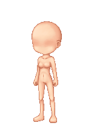

Usage
=====

1. Specify the rendered avatar position

```html
<div id="avatars">
	<canvas id="avatar" width="160" height="220">
		<div id="bc_avatar"></div>
	</canvas>
	<div id="dom_compiled">
		
	</div>
</div>
```

2. Specify an **equipped** section

```html
<div id="equipped">
</div>
```

3. Specify an **inventory** section

```html
<div id="inventory">
</div>
```

4. Specify **save** and **clear** operations

```html
<div id="options">
	<a href="#" id="save" >Save</a>
	<a href="#" id="clear">Clear</a>
</div>
```

5. Include the necessary scripts into your document

```html
<script type="text/javascript" src="avaku/config.js"></script>
<script type="text/javascript" src="avaku/linkedlist.js"></script>
<script type="text/javascript" src="avaku/algo.js"></script>
<script type="text/javascript" src="avaku/avatar.js"></script>
<script type="text/javascript" src="avaku/base.js"></script>
<script type="text/javascript" src="avaku/layer.js"></script>
<script type="text/javascript" src="avaku/itemfactory.js"></script>
<script type="text/javascript" src="images/Elidiun/elidiun.js"></script>
<script type="text/javascript" src="avaku/inventory.js"></script>
<script type="text/javascript" src="avaku/avaku.js"></script>
```

6. Initialize the scripts

```html
<script type="text/javascript">
function init() {
	Avaku.init();
}
window.addEventListener('DOMContentLoaded', init);
</script>
```

Adding Item Sources
=====================

There are two methods of defining a source of items: 1) Inheriting from
the `ItemFactory` or 2) setup the `AjaxFactory`.

Inheriting from the `ItemFactory`
---------------------------------

In order to define a source of items, we must inherit from the `ItemFactory`
and define the required methods:

1. `getItems(user, category)` Returns a list of items owned by a *user* under
a specified category.

2. `sendItems(user, avatar)` Defines how to update the *user*'s avatars on
the server side.

```javascript
var Elidiun = function() {
	this.matrix = {};
	this.matrix['head'] = [
		new Item('images/Elidiun/items/23h6qgw.jpg'),
		new Item('images/Elidiun/items/30b1b4g.jpg'),
		new Item('images/Elidiun/items/ancienp_hair_olive.png'),
		new Item('images/Elidiun/items/ancienp_hair_purple.png'),
		new Item('images/Elidiun/items/ancienp_hair_white.png'),
		new Item('images/Elidiun/items/ancienp_eyes_purple.png'),
		];
	this.matrix['upper'] = [
		new Item('images/Elidiun/items/SpaceROCK_Cape_Blue_U.png'),
		new Item('images/Elidiun/items/WINTERDOLL_DRESS_MALE_blonde.png'),
		new Item('images/Elidiun/items/femalehoodiedeepurple.png'),
		new Item('images/Elidiun/items/femalehoodieforest.png'),
		new Item('images/Elidiun/items/femalehoodiegray.png')
		];
	this.matrix['lower'] = [
		new Item('images/Elidiun/items/SWAGGER_JEANS_white.png'),
		new Item('images/Elidiun/items/StVRoses_f_skirt_white.png')
		];
	this.matrix['shoes'] = [
		new Item('images/Elidiun/items/converseblack.png')];
}

Elidiun.prototype = ItemFactory;

Elidiun.prototype.getItems = function(user, category) {
	return this.matrix[category];
};

Elidiun.prototype.sendItems = function(user, avatar) {
	// Do nothing
};
```
